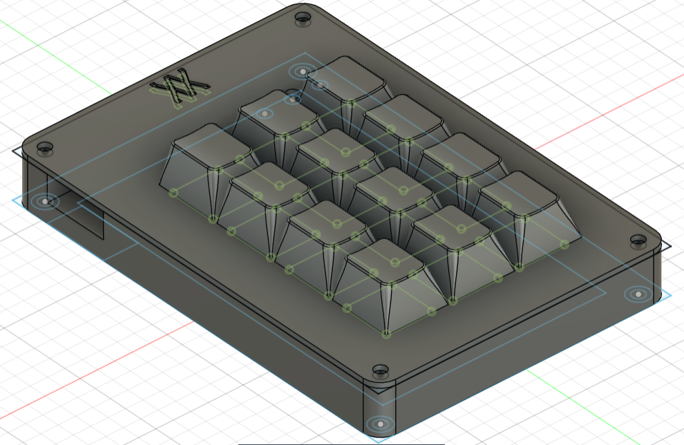
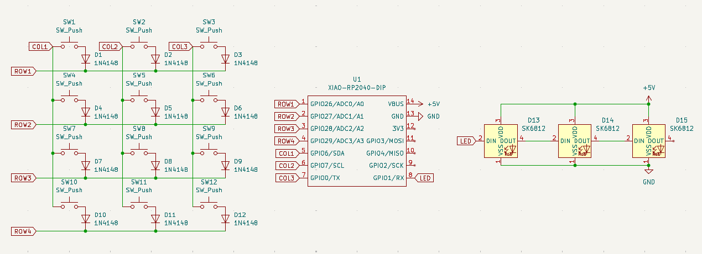
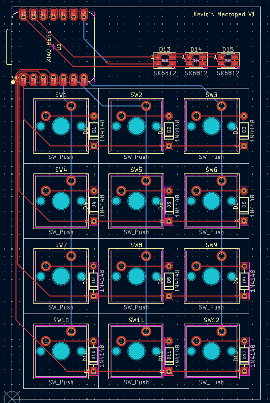
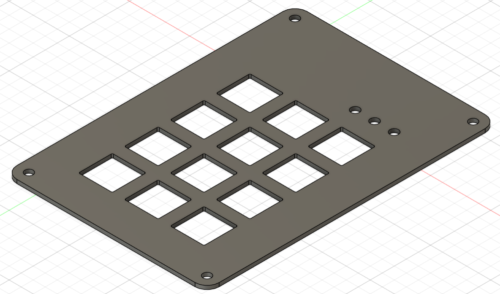
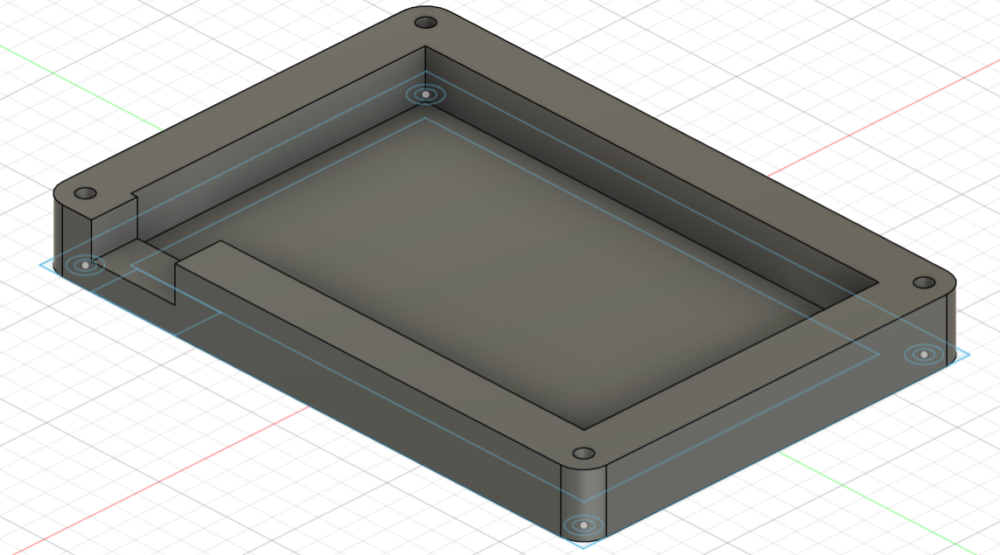

# Kevin's Custom Macropad
A custom macropad with remappable numpad keys. Has 0-9 plus modifiers. Made for [Hackclub's Blueprint](https://blueprint.hackclub.com/)

## Details
Made with KiCAD and Fusion360.

## About
This was my first hardware project involving CAD, so I had to learn KiCAD and Fusion from scratch to design the board and case.

## Images

### Schematic

### PCB

### Case

## BOM

- 1x Seeed XIAO RP2040 (Microcontroller)
- 16x Cherry MX Switches
- 16x Blank White DSA Keycaps
- 3x SK6812 MINI-E LEDs
- 4x M3x16 Bolt
- 4x M3 Heatset
